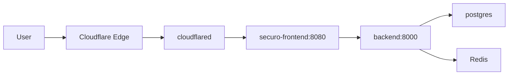

# Securo na Contabo + Cloudflare Tunnel

Deploy do **Securo Brasil V1** (`feature/finance-br`) na mesma VPS das suas outras apps Docker, exposto por **Cloudflare Zero Trust → Rotas de aplicativos publicados** (mesmo padrão de `n8n:5678` e `fire-monitor-agro:5000`).

| Público | Serviço interno |
|---------|-----------------|
| `https://financas.agromei.com.br` | `http://securo-frontend:8080` |

Hoje no painel Cloudflare, `financas.agromei.com.br` aponta para `http://agromonitor-edge:80` — isso precisa ser **alterado** para o Securo.

## Pré-requisitos

- Docker Engine + Compose v2
- `cloudflared` já rodando e na mesma rede Docker que `n8n` / `agromonitor-edge`
- Git

## 1. Descobrir a rede do tunnel

Na VPS (o nome do container pode variar — use `docker ps`):

```bash
docker ps --format '{{.Names}}'
docker network ls

# troque NOME pelo container do tunnel ou de um app que já funciona (ex. n8n-1)
docker inspect NOME --format '{{range $k, $v := .NetworkSettings.Networks}}{{println $k}}{{end}}'
```

Anote **uma** rede compartilhada com o `cloudflared`. Esse valor vai em `CLOUDFLARE_TUNNEL_NETWORK`.

## 2. Clone (caminho limpo)

Evite aninhar `deploy/contabo` dentro de outro `deploy/contabo`.

```bash
sudo mkdir -p /opt
cd /opt
# se já existir um clone bagunçado, use /opt/securo limpo:
git clone -b feature/finance-br https://github.com/RobisonM/securo.git securo
cd securo
mkdir -p secrets
cd deploy/contabo
```

## 3. Ambiente

```bash
cp .env.example .env
nano .env
```

| Variável | Valor |
|----------|--------|
| `SECRET_KEY` | `openssl rand -hex 32` |
| `POSTGRES_PASSWORD` | `openssl rand -hex 24` |
| `FRONTEND_URL` | `https://financas.agromei.com.br` |
| `CLOUDFLARE_TUNNEL_NETWORK` | rede descoberta no passo 1 |
| `TRUSTED_PROXY_HOPS` | `2` (cloudflared → nginx → backend) |

## 4. Subir

```bash
docker compose up -d --build
docker compose ps
docker compose logs -f backend
```

Confirme o DNS Docker na rede do tunnel:

```bash
docker run --rm --network "$CLOUDFLARE_TUNNEL_NETWORK" alpine wget -qO- http://securo-frontend:8080 | head
# ou, se alpine não tiver wget:
docker run --rm --network "$(grep CLOUDFLARE_TUNNEL_NETWORK .env | cut -d= -f2)" curlimages/curl -sI http://securo-frontend:8080
```

## 5. Cloudflare Zero Trust — rota publicada

1. Zero Trust → Networks → Tunnels → seu tunnel → **Public Hostname**
2. Edite **`financas.agromei.com.br`**
3. **Type:** HTTP (não HTTPS)
4. **Path:** `*` (igual às outras)
5. **Service / URL:** `http://securo-frontend:8080`  
   (**obrigatório** substituir `http://agromonitor-edge:80`)
6. Salve e aguarde ~30s

Não é necessário abrir porta no host nem Let’s Encrypt no servidor — o TLS fica na Cloudflare.

## Error 502 — diagnóstico

Na VPS, em `deploy/contabo`:

```bash
chmod +x diagnose-502.sh
./diagnose-502.sh
```

Causas mais comuns:

| Sintoma | Correção |
|---------|----------|
| Rota CF ainda em `agromonitor-edge:80` | Mudar para `http://securo-frontend:8080` |
| `securo-frontend` não existe / Exit | `docker compose logs` + `up -d --build` |
| Rede errada em `.env` | Mesma rede do `n8n` / `cloudflared` |
| Container fora da rede do tunnel | Ajustar `CLOUDFLARE_TUNNEL_NETWORK` e `up -d` |
| curl na rede do tunnel falha | CF sempre 502 até isso passar |

```bash
# rede do n8n / cloudflared
docker inspect n8n --format '{{range $k,$v := .NetworkSettings.Networks}}{{println $k}}{{end}}'
docker inspect cloudflared --format '{{range $k,$v := .NetworkSettings.Networks}}{{println $k}}{{end}}'

# containers securo
docker compose ps -a
docker compose logs backend --tail 80
docker compose logs frontend --tail 40
```



## 6. Validação

1. Abra `https://financas.agromei.com.br`
2. Crie conta / workspace
3. Dashboard vazio com CTA de import

```bash
docker compose exec backend alembic current
docker compose logs frontend --tail 50
```

## 7. Atualizar

```bash
cd /opt/apps/securo
git pull --ff-only origin feature/finance-br
cd deploy/contabo
docker compose up -d --build
```

## 8. Backup

```bash
docker compose exec -T db pg_dump -U postgres securo | gzip > securo-$(date +%F).sql.gz
docker volume ls | grep securo
```

## Layout

| Serviço | Exposição |
|---------|-----------|
| `securo-frontend` | rede do tunnel (`8080`) — sem porta no host |
| `backend` / `db` / `redis` / celery | só rede `internal` do Compose |

## Segurança

- Não commitar `.env`
- DB/backend não entram na rede do tunnel
- Troque `SECRET_KEY` e `POSTGRES_PASSWORD` no primeiro deploy

## Agents (opcional)

```bash
# .env
AGENTS_ENABLED=true
AGENTS_MCP_JWT_SECRET=$(openssl rand -hex 32)
COMPOSE_PROFILES=agents
docker compose --profile agents up -d --build
```
